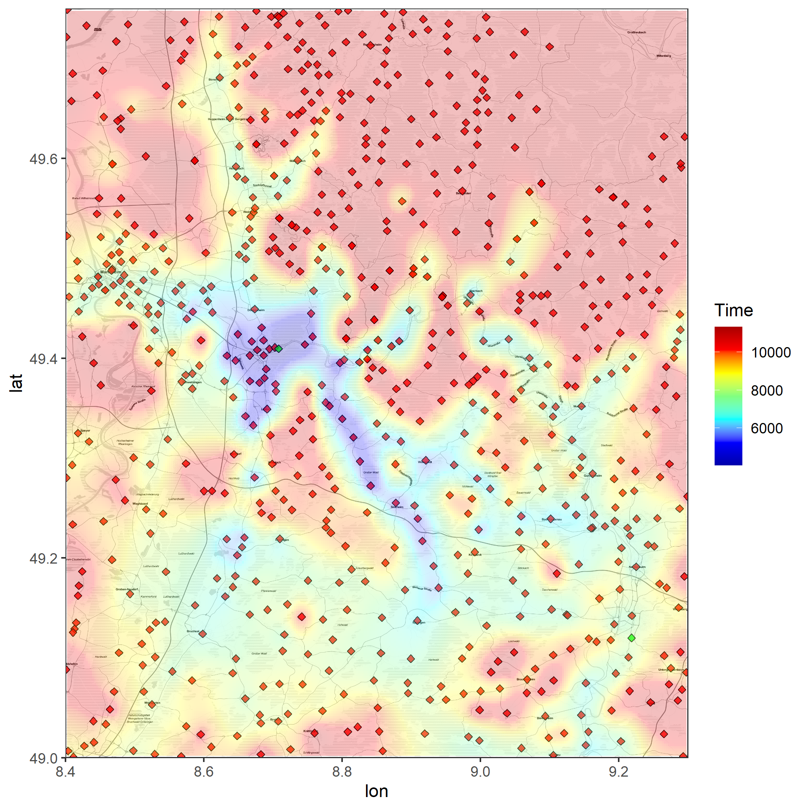
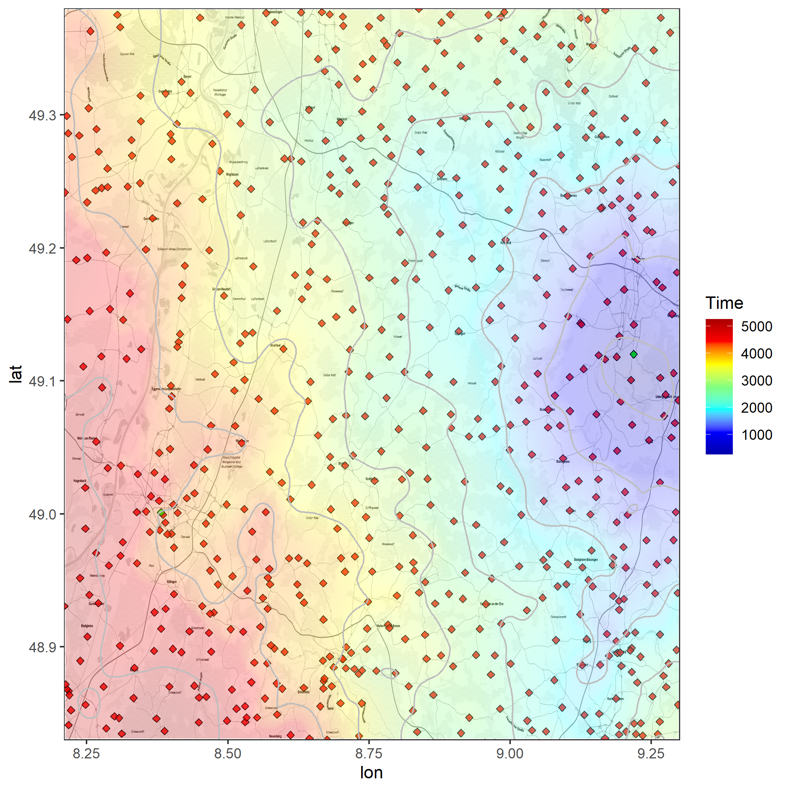

# R: Cumulative Commute Heatmap

## Example

### multiple destinations



### single destination



## Usage

### Install

You need to install some preqrequisites: The languages R and python and some packages for each are required.

You can install the python packages with `pip install -r requirements.txt` and the R packages with `Rscript requirements.r`.

### Run all

1. Note the borders of of your area in `data\borders.txt` as comma separated values in the order left, bottom, right, top.
2. Download an osm extract for your area, for example Germany from here: https://download.geofabrik.de/europe/germany.html<br>Put the osm file in the `data` folder and rename it to `osm.osm.pbf`.
    * If you have a more narrow choice of origins, you can also manually add them to `data\origins.csv`. The format is: `lat,lon`.
    * You should choose the smallest possible extract, because the bigger the file, the longer it takes to process it. See more details below.
3. Note the commuting destinations in `data\destinations.csv`. One per line lat,long with decimal dot and the commuting mode ("driving", "transit", "bicycling", "walking").
    * Right now only 2 destinations are supported.
4. Copy your Google Maps API key to `api.key`. It needs access to the [Distance Matrix API](https://developers.google.com/maps/documentation/distance-matrix/overview).
5. Run `./run.bat` to start the whole process.<br>3 Maps will be output: Cumulative `data\visualization-cum.png` and one each for the destinations.

### Run single steps

Each one of these steps can be run seperately, so if you change some data, you don't have to restart the whole process, but only the steps after the change.

* Follow steps 1 to 4 from above.
5. Run `scraper.py` to scrape all the towns in your area, output to `data\origins.csv`.
6. Run `distance.py`, to collect the data from the maps api about distance. The data will be output into `data\distances.pickle`.
7. Run `transform.py` to transform the data into a csv table at `data\dataset.csv`.
8. Run `visualization.r` to create the 3 heatmaps.

## Detailed information & Troubleshooting

### scrape.py

Scrapes all the towns in the area and outputs them to `data\origins.csv`. The format is: `lat,lon`.

The script uses osmium with an osm extract for full ofline use.

By default it selects all nodes with place tag "town", "village", "city" and "suburb". This may be too detailled for you. Or if you only want to use it for once city you could select all single addresses in a city, or all trainstations in an area. Since `origins.csv`, which is later used for the distance calculation is only coordinates, you can choose any filter that you want.

### transform.py

Has the option to manually add time to a commute, if you want to adjust the time from the Maps API.

This may be useful since you cannot combine transit and other modes of transportation explicitly. The use case would be setting the destination to central station, then adding 10 minutes that you know its gonna take to ride from central station to work.

The feature is deactivated by default, but you can activate it by setting `addman` to `True` in `transform.py`.

### osmium merge

Using a full German extract crashed after 14h.

You can combine multiple smaller osm extracts (eg from single federal states):

```bash
sudo apt install osmium-tool
osmium merge file1.osm.pbf file2.osm.pbf -o osm.osm.pbf
```

### Could not find Rscript

If you have R installed, but Rscript cannot be found, you need to add R to your PATH:

```cmd
PATH "C:\Program Files\R\R-4.2.0\bin";%path%
```
